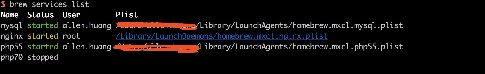

[TOC]
# Mac下php多版本安装和配置

### php-version弃用，改用brew-php-switcher

---

### Mac默认安装了较低版本的php，删除之，统一使用brew管理

```
# 查看
$ php -v
PHP 5.6.25 (cli) (built: Sep 19 2016 15:45:41) 
Copyright (c) 1997-2016 The PHP Group
Zend Engine v2.6.0, Copyright (c) 1998-2016 Zend Technologies

# 删除之
$ sudo rm -rf /private/etc/php-fpm.conf.default /private/etc/php.ini php.ini.default
$ sudo rm -rf /usr/bin/php /usr/bin/php-config /usr/bin/phpdoc /usr/bin/phpize
$ sudo rm -rf /usr/include/php
$ sudo rm -rf /usr/lib/php
$ sudo rm -rf /usr/sbin/php-fpm
$ sudo rm -rf /usr/share/php
$ sudo rm -rf /usr/share/man/man1/php-config.1 /usr/share/man/man1/php.1 /usr/share/man/man1/phpize.1
$ sudo rm -rf /usr/share/man/man8/php-fpm.8

作者：lianginet
链接：https://www.jianshu.com/p/81a6d5253d48
來源：简书
著作权归作者所有。商业转载请联系作者获得授权，非商业转载请注明出处。
```

### 安装多版本php
```
# 查找php
$ brew search php

# 添加brew的php源
$ brew tap homebrew/php
$ brew tap homebrew/dupes

# 安装php70
$ brew install php70

# 安装php55
# 前面已经安装了php70，需要先unlink
$ brew unlink php70
$ brew install php55

```
### 配置php-fpm
由于各个php-fpm的版本不同，nginx监听php-fpm端口也是不同的，所以需要对各个版本的php-fpm的监听端口进行设置，下面进入各自的php-fpm的配置目录一般是在/usr/local/etc/php/{version}

> php7.0

采用默认端口9000


在nginx的虚拟主机配置如下


> php5.5
采用端口9001


在nginx的虚拟主机配置如下


### 将两个版本的php-fpm都启动
```
# 启动php7.0
$ brew services start php70

# 启动php5.5
$ brew services start php55

```

### 查看brew安装软件的执行情况
```
# 命令
$ brea services list

请看下图：
```


### 使用php-version管理多版本
```
# 安装php-version
$ brew install php-version
# 然后执行
$ source $(brew --prefix php-version)/php-version.sh

# 查看当前php版本
$ php-version

# 设置环境变量,可以设置到.bashrc或.bash_profile或.zshrc
$ echo "source $(brew --prefix php-version)/php-version.sh" >> ~/.
```

### 最后重启nginx

```
# 先进行测试
$ sudo nginx -t

# 如果配置无误就显示
nginx: the configuration file /usr/local/etc/nginx/nginx.conf syntax is ok
nginx: configuration file /usr/local/etc/nginx/nginx.conf test is successful

# 再平滑重启，看页面效果
$ sudo nginx -s reload
```
---

# 知识补充

### PS nginx依赖组件zlib安装

```
# 错误
checking if the location of ZLIB install directory is defined... no
configure: error: Cannot find libz

# 查询是否安装了zlib
$ brew search zlib
homebrew/dupes/zlib   lzlib

# 若未安装则
$ brew install zlib
# 若已安装则可能是需要安装xcode-select
# 执行
$ xcode-select --install
```

### PS brew下的php版本切换
```
# 使用brew切换php版本如：
$ brew unlink php55 && brew link php70
```

### PS php-version的坑
```
php-version只能作用在当前终端下
打开其他终端无效

```

### PS brew对应用的管理
> 1.查看服务状态

```
brew services list
```

> 2.停止服务程序

```
brew services stop [服务器程序]		//brew services stop php55
```

> 3.启动服务程序

```
brew services start [服务程序]		//brew services start php70
```

> 4.重启服务程序

```
brew services restart [服务程序]	//brew service restart php55
```

### PS brew安装PHP扩展

> 1.先搜索扩展库

```
brew search php70 | grep xdebug
```

> 2.安装扩展

```
brew install php70-redis

# 重启php-fpm
brew services restart php70		//以php7.0为例

# 如果安装不成功
a) php -v
b) breaw reinstall '出错的依赖包' --build-from-source

```


### PS nginx的开启|停止|重启命令说明
```
# 配置测试
$ sudo nginx -t -c /path/to/nginx.conf 	//测试nginx配置是否正确

# 启动
$ sudo nginx -c /path/to/nginx.conf

# 停止
$ sudo nginx -s stop	//快速停止nginx
$ sudo nginx -s quit	//完整有序的停止nginx
$ sudo pkill -9 nginx	//强制停止nginx

# 重启
$ sudo nginx -s reload	//平滑重启，不影响程序运行
```

### 来源
> [https://www.jianshu.com/p/81a6d5253d48]()